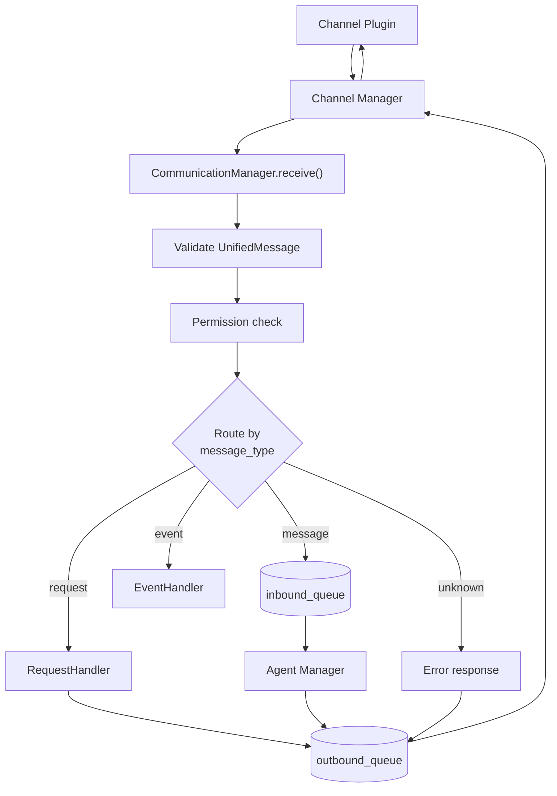

# PHB Device Protocol v2 -- Unified Design

Abiding by the no-backward-compatibility rule.

## Design Principles

1. **One format**: `UnifiedMessage` is the only message format. No parallel frame types.
2. **One pipeline**: Everything flows Channel Plugin -> Channel Manager -> Communication Manager -> Handler -> outbound queue -> back. No shortcuts, no bypasses.
3. **Channel-agnostic**: The design works identically for channel-device, channel-telegram, channel-iot, or any future channel. Channel plugins translate their native protocol into UnifiedMessage.
4. **Centralized routing**: Communication Manager is the single place that decides where a message goes.

## UnifiedMessage: Current Structure (v0.1)

`UnifiedMessage` v0.1 has already been implemented with the following structure:

```python
class MessageRouting(BaseModel):
    id: str = Field(default_factory=lambda: uuid4().hex)
    channel: str
    direction: str          # "inbound" | "outbound"
    sender_id: str
    recipient_id: str | None = None
    timestamp: datetime = Field(...)
    metadata: dict[str, Any] = Field(default_factory=dict)

class ContentItem(BaseModel):
    content_type: str       # "text" | "image" | "audio" | "video" | "file" | "location" | ...
    body: str = ""
    metadata: dict[str, Any] = Field(default_factory=dict)

class UnifiedMessage(BaseModel):
    version: str = "0.1"
    message_type: str = MESSAGE_TYPE_MESSAGE
    routing: MessageRouting
    content: list[ContentItem]  # at least 1 item for message_type "message"
```

## Adding request_id for request/response

To implement the request/response pattern, add `request_id` directly to `UnifiedMessage` (alongside `message_type`) since it is a protocol-level correlation field, not routing and not content:

```python
class UnifiedMessage(BaseModel):
    version: str = "0.1"
    message_type: str = MESSAGE_TYPE_MESSAGE
    request_id: str | None = None   # new — ties a request to its response
    routing: MessageRouting
    content: list[ContentItem]
```

Add to [constants.py](hiroserver/hiro-channel-sdk/src/hiro_channel_sdk/constants.py) — `MESSAGE_TYPE_*` constants are already present:

```python
MESSAGE_TYPE_MESSAGE: str = "message"    # already implemented
MESSAGE_TYPE_REQUEST: str = "request"    # reserved
MESSAGE_TYPE_RESPONSE: str = "response"  # reserved
MESSAGE_TYPE_STREAM: str = "stream"      # reserved
```

**Why `request_id` lives on `UnifiedMessage` directly, not inside `routing`:**

`routing` answers "who sent this and where does it go". `request_id` answers "which earlier message is this a response to" — it's a protocol-level correlation ID orthogonal to routing. Keeping it at the top level alongside `message_type` makes it equally visible.

**message_type values:**

- `"message"` (implemented) -- content exchange: chat text, images, audio, video, files
- `"request"` -- expects a response. `request_id` is required. `content` carries a JSON item: `{"method": "channels.list", "params": {}}`
- `"response"` -- answer to a request. `request_id` matches the request's. `content` carries a JSON item: `{"status": "ok", "data": {...}}`
- `"event"` -- notification, fire-and-forget. `content` carries a JSON item: `{"event": "message.delivered", "data": {...}}`

**request_id**: A UUID set by the requester and echoed by the responder. `None` for `"message"` and `"event"` types.

## Routing: Communication Manager Evolution

Currently, Communication Manager has one inbound queue and one consumer (Agent Manager). It evolves into a router.

[communication_manager.py](phbserver/phbcli/src/phbcli/runtime/communication_manager.py) changes:




The `receive()` method gains a routing step after validation and permission checks:

- `message_type == "message"` -> `inbound_queue` (Agent Manager consumes, unchanged)
- `message_type == "request"` -> `RequestHandler.handle(msg)` (new)
- `message_type == "event"` -> `EventHandler.handle(msg)` (new, initially just logging)
- unknown -> enqueue error response back to sender

## Request Handler (New Component)

A method registry that processes request messages and enqueues responses. Lives alongside Agent Manager as another consumer in the server process.

```python
class RequestHandler:
    def __init__(self, comm: CommunicationManager, workspace_path: Path):
        self._comm = comm
        self._workspace_path = workspace_path
        self._methods: dict[str, MethodHandler] = {}

    def register(self, method: str, handler: MethodHandler): ...

    async def handle(self, msg: UnifiedMessage) -> None:
        # Parse body as JSON -> extract method + params
        # Look up handler
        # Call handler, get result or error
        # Build response UnifiedMessage with same request_id
        # Enqueue on outbound queue
```

Method handlers are simple async functions:

```python
async def channels_list(params: dict, context: RequestContext) -> dict:
    channels = list_channels(context.workspace_path)
    return {"channels": [ch.model_dump() for ch in channels]}
```

The response flows back as a normal outbound UnifiedMessage:

```python
UnifiedMessage(
    message_type="response",
    request_id=request.request_id,
    routing=MessageRouting(
        channel=request.routing.channel,
        direction="outbound",
        sender_id="server",
        recipient_id=request.routing.sender_id,
        metadata=request.routing.metadata,  # preserve channel_id etc.
    ),
    content=[ContentItem(
        content_type="json",
        body=json.dumps({"status": "ok", "data": result}),
    )],
)
```

The outbound path is unchanged: Communication Manager -> Channel Manager -> Channel Plugin.

**Error in request handling:**

```json
{"status": "error", "error": {"code": "method_not_found", "message": "Unknown method: foo.bar"}}
```

## Error Handling for Content Messages

When a regular message (`message_type: "message"`) fails processing, the server sends an event back to the sender:

```python
UnifiedMessage(
    message_type="event",
    routing=MessageRouting(
        channel=original.routing.channel,
        direction="outbound",
        sender_id="server",
        recipient_id=original.routing.sender_id,
    ),
    content=[ContentItem(
        content_type="json",
        body=json.dumps({
            "event": "message.error",
            "data": {"message_id": original.routing.id, "reason": "..."}
        }),
    )],
)
```

This uses the same outbound pipeline. The device can listen for `message.error` events and update message status accordingly.

Delivery receipts work the same way -- `message.delivered`, `message.read` events.

## What Changes Where

### Server side


| File                                                                                                 | Change                                                                                                                                                                     |
| ---------------------------------------------------------------------------------------------------- | -------------------------------------------------------------------------------------------------------------------------------------------------------------------------- |
| [phb-channel-sdk/models.py](phbserver/phb-channel-sdk/src/phb_channel_sdk/models.py)                 | Add `message_type` and `request_id` fields to `UnifiedMessage`                                                                                                             |
| [phb-channel-sdk/constants.py](phbserver/phb-channel-sdk/src/phb_channel_sdk/constants.py)           | Add `MESSAGE_TYPE_*` constants                                                                                                                                             |
| [communication_manager.py](phbserver/phbcli/src/phbcli/runtime/communication_manager.py)             | Add routing in `receive()` based on `message_type`. Dispatch to RequestHandler, EventHandler, or inbound_queue                                                             |
| New: `request_handler.py`                                                                            | Method registry, dispatches requests, enqueues responses                                                                                                                   |
| New: `event_handler.py`                                                                              | Handles inbound events (initially just logging)                                                                                                                            |
| [server_process.py](phbserver/phbcli/src/phbcli/runtime/server_process.py)                           | Wire RequestHandler and EventHandler into the server startup                                                                                                               |
| [channel-device/plugin.py](phbserver/channels/phb-channel-devices/src/phb_channel_devices/plugin.py) | No changes needed -- it already translates gateway payloads to UnifiedMessage. The new fields pass through naturally since `model_validate` accepts extra/optional fields. |
| [agent_manager.py](phbserver/phbcli/src/phbcli/runtime/agent_manager.py)                             | No changes -- it already only processes `content_type == "text"` from the inbound queue                                                                                    |


### Flutter side


| File                                                                                           | Change                                                                                                                         |
| ---------------------------------------------------------------------------------------------- | ------------------------------------------------------------------------------------------------------------------------------ |
| [gateway_protocol.dart](device_apps/lib/data/remote/gateway/gateway_protocol.dart)             | Parse `message_type` from payload, classify frames                                                                             |
| [message_send_notifier.dart](device_apps/lib/application/messages/message_send_notifier.dart)  | Add `message_type: "message"` to outbound payloads                                                                             |
| [message_repository_impl.dart](device_apps/lib/data/repositories/message_repository_impl.dart) | Filter: only process frames with `message_type == "message"` (or absent for legacy)                                            |
| New: `device_api_client.dart`                                                                  | Sends request frames, tracks pending requests by `request_id`, completes Dart Futures when responses arrive. Timeout handling. |
| New: event listener                                                                            | Processes `message_type == "event"` frames, updates local state (delivery receipts, error handling, etc.)                      |


### What stays the same

- **Gateway relay** -- no changes. Envelope format unchanged. Gateway doesn't inspect payloads.
- **Channel Manager** -- no changes. It already forwards `channel.receive` to Communication Manager and dispatches `channel.send` outbound. The new fields are just part of the UnifiedMessage dict it passes through.
- **channel-device plugin** -- minimal or no changes. `model_validate` accepts the new optional fields.
- **Agent Manager** -- no changes. It reads from the same inbound_queue, processes text, ignores the rest.

## Conversation Channels

A device can participate in multiple conversations (like WhatsApp has multiple chats). This is already partially in place:

- Flutter sends `channel_id` in metadata when sending a message
- Server creates conversation threads keyed by `channel:sender_id` in [conversation_channel.py](phbserver/phbcli/src/phbcli/domain/conversation_channel.py)

The `channels.list` request would return these conversation channels so the device knows what's available. Creating/managing conversations is a future method (`channels.create`, etc.).

Note: there's currently a mismatch -- the device sends a `channel_id` in metadata, but the server resolves threads via `channel:sender_id`. This should be reconciled as part of the conversation channel work, but is not blocking the protocol design.

## Streaming (Deferred)

Streaming (e.g., LLM token-by-token responses) is deferred to a future iteration. When needed, it could work as a series of event messages with a shared `stream_id` in metadata, or via a dedicated `message_type: "stream"` with start/chunk/end semantics. The current design doesn't preclude either approach.

## First Implementation: channels.list

End-to-end flow for the first use case:

1. Flutter device sends over WebSocket:

```json
{
  "payload": {
    "version": "0.1",
    "message_type": "request",
    "request_id": "abc-123",
    "routing": {
      "channel": "devices",
      "direction": "outbound",
      "sender_id": "phone-1",
      "metadata": {}
    },
    "content": [
      { "content_type": "json", "body": "{\"method\": \"channels.list\", \"params\": {}}" }
    ]
  }
}
```

1. Gateway relays to channel-device (injects sender_device_id)
2. channel-device builds UnifiedMessage, emits via `channel.receive`
3. Channel Manager forwards to Communication Manager
4. Communication Manager sees `message_type: "request"`, dispatches to RequestHandler
5. RequestHandler parses method `channels.list`, calls `list_channels()` from [conversation_channel.py](phbserver/phbcli/src/phbcli/domain/conversation_channel.py)
6. RequestHandler builds response UnifiedMessage, enqueues outbound
7. Communication Manager -> Channel Manager -> channel-device -> gateway -> device
8. Flutter `DeviceApiClient` matches `request_id: "abc-123"`, completes the pending Future with the channel list

The same `list_channels()` function is reusable by HTTP endpoints, CLI tools, or any future transport.

## Method Namespace (Initial, Extensible)

- `channels.list` -- list conversation channels
- `channels.create` -- create a new conversation channel
- Future: `bots.list`, `settings.get`, `settings.update`, `devices.list`, `messages.history`

