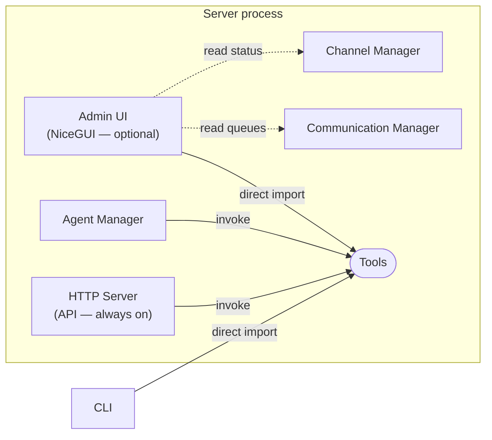

The Admin UI is an optional web dashboard for managing a workspace from a browser. It exposes the same operations as the CLI and the HTTP API — workspace CRUD, device pairing, channel management, chat viewing, and log tailing — through a visual interface running on `localhost`.

---

## Why a web UI

The CLI is the primary interface for Hiro League, but certain tasks are better suited to a persistent visual dashboard:

- **Monitoring** — watching chat messages, server logs, and plugin logs in real time is awkward in a terminal. A browser tab with live-updating panels is more practical.
- **Overview** — a dashboard showing workspace count, device count, online status, and channel health gives an at-a-glance picture that requires multiple CLI commands to assemble.
- **CRUD operations** — adding a workspace, pairing a device, or toggling a channel involves fewer steps in a form than in a terminal.

The web UI does not replace the CLI. It is an additional caller of the same [Tool interface](/architecture/tools-architecture), sitting alongside the CLI, the HTTP API, and the AI agent.

---

## Why NiceGUI

The project is Python-only on the server side. Introducing a JavaScript/TypeScript frontend would add a build toolchain, a package manager, a bundler, and a new language to the codebase. NiceGUI avoids all of that.

| Criterion | NiceGUI |
|---|---|
| Language | Python — no JS/TS build step |
| Framework | Built on FastAPI and Starlette |
| Real-time | Native WebSocket push to browser — no polling |
| Components | Tables, forms, tabs, log viewers, charts, markdown rendering |
| Styling | Tailwind CSS + Quasar (Vue.js) under the hood, authored in Python |
| Integration | Can run as a standalone Uvicorn instance on its own port |

### Fit with the existing stack

NiceGUI is FastAPI under the hood. The server process already runs FastAPI for the HTTP API. NiceGUI uses the same Uvicorn + asyncio model, so it slots into the existing event loop as another coroutine — identical to how `run_http_server` works today.

Because the admin UI runs **inside the workspace server process**, it has direct Python access to:

- The `ToolRegistry` — call any tool without HTTP round-trips
- The `ChannelManager` — read live channel status
- The `CommunicationManager` — tap into inbound/outbound message queues for chat viewing
- The workspace path — read conversation JSONL files, config, state, and log files directly

No new REST endpoints or internal APIs are needed for the initial version. The UI calls `tool.execute()` in-process, the same way the CLI does.

---

## Architecture

The admin UI runs as a conditional coroutine inside the workspace server process. It starts only when the user passes `--admin` to `phbcli start`.



<Frame caption="View full size">
  
</Frame>

### Startup

```bash
# Start server with admin UI
phbcli start --admin

# Start server without admin UI (default, unchanged)
phbcli start
```

The `--admin` flag is a boolean on the `start` command and the `StartTool`. When set, the server process adds `run_admin_ui(config, stop_event)` to its coroutine list alongside the existing four coroutines.

### Port allocation

The admin UI runs on a **separate port** from the HTTP API. 4 ports are reserved per workspace slot:

| Offset | Service | Example (slot 0) |
|---|---|---|
| +0 | HTTP API | 18080 |
| +1 | Plugin WebSocket | 18081 |
| +2 | *(reserved)* | — |
| +3 | Admin UI | 18083 |

`PORT_OFFSET_ADMIN = 3` and `admin_port_for()` compute the admin port from the workspace slot. The `Config` model carries an `admin_port` field set during `phbcli setup`.

### Localhost only

The admin UI binds to `127.0.0.1` exclusively. It is not accessible from other machines on the network. This is enforced at the Uvicorn config level — the host is hardcoded, not configurable.

```python
uvicorn.Config(
    app=nicegui_app,
    host="127.0.0.1",
    port=config.admin_port,
)
```

---

## Page structure

The admin UI uses a collapsible sidebar with grouped navigation. All pages share a consistent layout: sidebar on the left, content area on the right, with the workspace name and server status displayed in the header.

### Sidebar groups and pages

```
Server
├── Dashboard
├── Workspaces
├── Channels
└── Agents

Nodes / Devices
├── Devices
└── Chats

Configuration
└── Logs
```

---

## Table action button rules

Action buttons inside data table rows must follow these rules.

### Sizing and spacing

1. **Never add `dense` to action icon buttons.** `dense` reduces the touch target to ~24px — adjacent buttons become too close to tap reliably, especially on touch screens or high-density displays.

2. **Add `class="q-ma-xs"` to every action button.** This applies a 4 px margin on all sides, creating visible gaps between adjacent buttons and a larger effective click area.

3. **Use `size="sm"` for icon-only buttons in compact table rows.** `sm` is large enough for a comfortable tap target without inflating the row height.

```python
# Correct — adequate target, spaced apart
'<q-btn flat size="sm" icon="play_arrow" class="q-ma-xs" @click="..." />'

# Incorrect — dense kills the hit target; no margin packs buttons together
'<q-btn flat dense size="sm" icon="play_arrow" @click="..." />'
```

### Workspace management safety rules

These rules apply to the Workspaces page and must be enforced both at the tool layer (for CLI / agent callers) and at the UI layer (for context-specific restrictions).

| Action | Condition | Behaviour |
|---|---|---|
| **Remove** | Workspace is running | Blocked. Tool raises `WorkspaceError`: stop the server first. |
| **Remove** | Workspace is the default and others exist | Blocked. Tool raises `WorkspaceError`: set another workspace as default first. |
| **Set default** | Workspace is not configured | Blocked. Tool raises `WorkspaceError`: run `phbcli setup` first. |
| **Stop** | Workspace is the current Admin UI workspace | Blocked in UI only. Notification explains to use another workspace's Admin UI. |
| **Remove** | Workspace is the current Admin UI workspace | Blocked in UI only. Delete button replaced with a lock icon; notification explains. |

The "current Admin UI workspace" check is UI-context only. The workspace whose server process is running the Admin UI is identified by `ui_state.workspace_id` (immutable UUID), which is set at startup from the workspace registry. Tools have no awareness of which workspace is serving the UI — this protection lives entirely in the page layer.

### Restart dialog

When restarting a workspace, a confirmation dialog is shown before calling `RestartTool`. The dialog includes an **"Also start Admin UI"** checkbox:

- For non-current workspaces: unchecked by default, user can toggle freely.
- For the current Admin UI workspace: checked and **disabled** (forced on). Restarting without re-enabling the Admin UI would disconnect the browser session with no way to reconnect from the same UI.

---

## Color theme

The admin UI supports light and dark mode. Dark mode preference is stored in per-browser persistent storage (`app.storage.user`) so it survives page navigations and server restarts.

### Rules

1. **Never hardcode Tailwind palette colors on text or icons.** Classes like `text-gray-500`, `text-green-600`, or `text-blue-500` are fixed values — they do not respond to Quasar's `body--dark` class and cause invisible or unclear text when the theme changes.

2. **Use Quasar semantic color roles.** These are theme-aware by design:

| Quasar class | Purpose |
|---|---|
| `text-primary` | Brand accent — links, active nav items, icons in the header |
| `text-positive` | Success / ok state (e.g. "Connected", running counts) |
| `text-negative` | Error / failure state (e.g. "Disconnected") |
| `text-warning` | Warning state |
| `text-info` | Informational highlight |

3. **Use `opacity-*` for muted or subdued text and icons.** Opacity modulates the *current* theme color — it looks correct in both light and dark mode without knowing the background.

   ```python
   ui.icon("wifi_off").classes("text-3xl opacity-50")   # muted icon
   ui.label("subtitle").classes("text-sm opacity-60")    # muted label
   ```

4. **Let body text inherit.** The default Quasar body color is white in dark mode and near-black in light mode. Headings and value labels that carry no semantic meaning should carry no color class — they inherit automatically.

5. **Use `color="white"` on buttons inside `QHeader`.** The header background uses the primary color. Flat buttons must declare `color="white"` (a Quasar named role, not a hex value) so their icons are visible on the primary-colored background.

   ```python
   ui.button(icon="menu", on_click=drawer.toggle).props('flat dense round color="white"')
   ```

6. **Use Quasar structural components — not Tailwind utility divs — for layout.** `QHeader`, `QDrawer`, `QItem`, and `QCard` auto-adapt their background and text to the active theme. Wrapping layout in plain `div` with Tailwind background colors breaks dark mode.

### Sidebar behavior

The sidebar drawer uses `behavior="desktop"` so it pushes the page content aside rather than overlaying it. The `bordered` prop adds a separator line between drawer and content area. The header menu button toggles **mini mode**: the sidebar stays open but narrows to show only icons (labels and section headers are hidden via Quasar’s `q-mini-drawer-hide` class). Mini state is persisted in user storage.

On mobile breakpoints Quasar automatically switches to overlay mode regardless of this setting.

---

## Pages

### Dashboard

The landing page. Shows aggregate statistics from existing data — no new APIs needed.

| Statistic | Data source |
|---|---|
| Total workspaces | `WorkspaceListTool` |
| Running workspaces | `StatusTool` |
| Total paired devices | `DeviceListTool` per workspace |
| Gateway connected | `StatusTool` (ws_connected) |
| Installed channels | `ChannelListTool` per workspace |
| Enabled channels | `ChannelListTool` (filtered) |

The dashboard calls tools in-process to assemble these numbers on page load. No real-time push needed — the user refreshes or navigates back to see updated counts.

### Workspaces

A table of all registered workspaces. Columns: name, setup status, server status (running/stopped), gateway URL, HTTP port, admin port, default flag.

Data source: `WorkspaceListTool` (includes `id`, `is_configured`, `gateway_url`, `admin_port`); running state derived from `phbcli.pid` per workspace path.

Actions per row:

| Button | Condition shown | Tool called |
|---|---|---|
| **Start** (play) | Configured + stopped | `StartTool` |
| **Stop** (square) | Running, not current UI workspace | `StopTool` |
| **Restart** | Running | `RestartTool` (via confirmation dialog) |
| **Edit** (pencil) | Always | `WorkspaceUpdateTool` (name, gateway URL, default flag) |
| **Remove** (trash) | Not current UI workspace | `WorkspaceRemoveTool` |
| **Lock** icon | Current UI workspace | Disabled — visual indicator only |

The table uses `@ui.refreshable` so all mutation actions call `.refresh()` in-process rather than navigating away.

See [Table action button rules](#table-action-button-rules) and [Workspace management safety rules](#workspace-management-safety-rules) for the interaction constraints applied here.

### Channels

A table of channel plugins for a selected workspace with columns: name, enabled status, command, config keys.

A **workspace selector** in the page header switches between workspaces. Changing the selection refreshes the channel table via `@ui.refreshable`.

Data source: `ChannelListTool`.

Actions per row:
- **Enable / Disable toggle** — icon button that calls `ChannelEnableTool` or `ChannelDisableTool` and refreshes the table. The mandatory `devices` channel displays a lock icon instead and cannot be toggled.

Config keys are rendered as chips. Install, setup, and remove actions are planned for a future version.

### Agents

A workspace selector in the header scopes both the Configuration and tool list to the selected workspace.

**Configuration** — read-only display of the default agent's settings from `workspace.db`. Data source: `load_agent_config()` and `load_system_prompt()`.

| Field | Description |
|---|---|
| Provider | LLM provider identifier (e.g. `openai`) |
| Model | Model name (e.g. `gpt-4.1-mini`) |
| Temperature | Sampling temperature |
| Max tokens | Maximum tokens per response |
| System prompt | Full system prompt text |

**Registered tools** — expandable list of every tool the agent can invoke. Each entry shows the tool name, description, and parameter schema (type, description, optional flag). Data source: `all_tools()`.

**Coming soon** placeholder cards (one card per section, displayed below the live content):

| Section | Description |
|---|---|
| Tool call history | Record of tool invocations with parameters and results |
| Active conversations | Live list of conversation thread IDs |
| Conversation memory | View checkpointed LangGraph state per thread |
| Model configuration | Edit model, provider, temperature, max tokens |
| Token usage | Aggregated token consumption statistics |

### Devices

A workspace selector in the header scopes device operations to the selected workspace.

**Pair new device** — a card with a button that calls `DeviceAddTool`. On success, a modal dialog displays the generated code in large monospace text with its expiry timestamp. The device list refreshes automatically after a code is generated.

**Approved devices** — a table with columns: device ID, paired date, expiry date. Each row has a **Revoke** action (link-off icon) that opens a confirmation dialog and calls `DeviceRevokeTool`. The table refreshes in-process via `@ui.refreshable`.

### Chats

<Note>Not yet implemented — registered as a stub page that displays "Coming soon".</Note>

Planned two-panel layout:

**Left panel** — list of conversation channels. Each entry represents a JSONL file in the workspace's `conversations/` directory. The channel ID (filename without extension) is displayed. Clicking a channel loads its messages in the right panel.

**Right panel** — message list for the selected channel. Messages are loaded via `read_messages()` from the conversation log module. Each message shows sender, timestamp, and content. Messages are displayed in chronological order, newest at the bottom.

Data source: filesystem scan of `<workspace>/conversations/*.jsonl` for channel list, `conversation_log.read_messages()` for message content. No new tools needed.

### Logs

<Note>Not yet implemented — registered as a stub page that displays "Coming soon".</Note>

Planned two tabs:

**Server logs** — live tail of the main server log file from `<workspace>/logs/`. New lines are pushed to the browser via NiceGUI's WebSocket as they appear. The log viewer supports auto-scroll with a pause button.

**Plugin logs** — live tail of `plugin-*.log` files from the same log directory. Each plugin log is displayed in a separate sub-tab or as a combined view with plugin name prefixed to each line.

The tailing mechanism mirrors the existing `_tail_plugin_logs` coroutine in `server_process.py` — polling the files for new content and pushing it to the UI.

---

## Dependency

NiceGUI is added to `phbcli/pyproject.toml`:

```toml
dependencies = [
    ...,
    "nicegui>=2.0",
]
```

No other new dependencies are needed. NiceGUI brings its own Quasar/Vue.js frontend assets bundled in the Python package.

---

## File layout

```
phbcli/src/phbcli/
├── ui/
│   ├── __init__.py
│   ├── app.py              # NiceGUI app setup, layout shell, sidebar
│   ├── run.py              # run_admin_ui() coroutine for server_process.py
│   └── pages/
│       ├── __init__.py
│       ├── dashboard.py
│       ├── workspaces.py
│       ├── channels.py
│       ├── agents.py
│       ├── devices.py
│       │                   # chats and logs are stub routes registered in app.py
├── runtime/
│   ├── server_process.py   # modified: conditionally adds admin UI coroutine
│   └── http_server.py      # unchanged
├── tools/                  # unchanged — admin UI calls tools directly
└── commands/
    └── root.py             # modified: --admin flag on start command
```

---

## What the admin UI is not

- **Not a replacement for the CLI.** The CLI remains the primary interface and works without a running server. The admin UI requires a running server process.
- **Not a remote management tool.** It binds to localhost only. Remote access would require a reverse proxy or tunnel, which is out of scope.
- **Not a new API surface.** The admin UI calls tools in-process. It does not introduce new HTTP endpoints or WebSocket protocols.
- **Not always running.** It starts only when explicitly requested via `--admin`. The server's core functionality is unaffected when the admin UI is not running.
