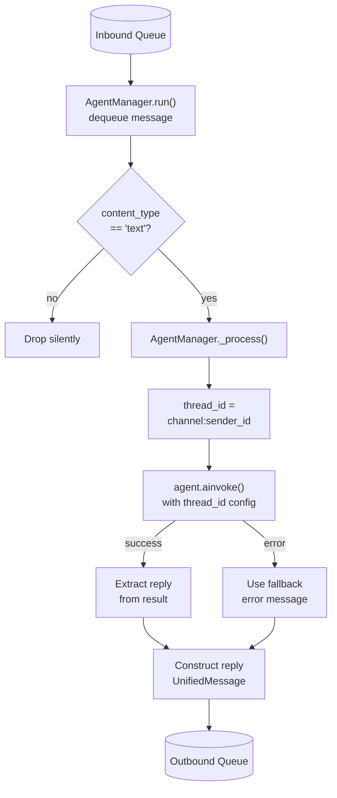

The Agent Manager is the LLM brain of the server. It runs as a long-lived asyncio worker alongside the Communication Manager and Channel Manager. For every inbound text message it invokes a LangChain agent, maintains per-conversation memory, and pushes the reply back through the Communication Manager's outbound queue to the originating channel.

---

## Message flow

The Agent Manager processes one message at a time. Non-text messages (images, audio, etc.) are drained from the queue and silently dropped — the current worker is the only consumer of `inbound_queue`.



<Frame caption="View full size">
  
</Frame>

---

## Conversation memory

Each conversation is isolated by a `thread_id` built from `channel:sender_id`. The agent uses a LangGraph `InMemorySaver` checkpointer shared across all conversations — the full message history for each thread is stored in memory and passed automatically on every invocation.

This means the agent remembers context within a conversation across multiple exchanges, without you needing to resend history.

<Warning>
  Memory is lost on server restart. For persistence across restarts, `InMemorySaver` can be replaced with `SqliteSaver` or `PostgresSaver` from LangGraph — this is planned for a future release.
</Warning>

---

## Tools

The Agent Manager loads all registered Hiro League tools at startup via `all_tools()` and makes them available to the agent. The agent can invoke any of these tools as part of processing a message.

Current tool categories available to the agent:

| Category | Tools |
|---|---|
| **Devices** | `device-add`, `device-list`, `device-revoke` |
| **Channels** | `channel-list`, `channel-install`, `channel-setup`, `channel-enable`, `channel-disable`, `channel-remove` |
| **Workspaces** | `workspace-list`, `workspace-create`, `workspace-remove`, `workspace-set-default`, `workspace-show` |
| **Server** | `setup`, `start`, `stop`, `status`, `teardown`, `uninstall` |

These are the same tools available through the CLI and HTTP Server. See [Tools architecture](/architecture/tools-architecture) for how the shared tool interface works.

---

## Configuration

All agent configuration lives under `<workspace>/agent/`. Files are created with safe defaults on first run if absent.

### `<workspace>/agent/config.json`

Controls which LLM provider and model the agent uses.

```json
{
  "provider": "openai",
  "model": "gpt-4.1-mini",
  "temperature": 0.7,
  "max_tokens": 1024
}
```

| Field | Type | Description |
|---|---|---|
| `provider` | string | LangChain provider identifier — e.g. `openai`, `anthropic`, `ollama` |
| `model` | string | Model name understood by the provider — e.g. `gpt-4.1-mini`, `claude-sonnet-4-5` |
| `temperature` | float 0–2 | Sampling temperature |
| `max_tokens` | int | Maximum tokens in the generated reply |

The `provider` and `model` values are combined as `"provider:model"` and passed to `langchain.chat_models.init_chat_model`.

To switch providers, install the corresponding LangChain package and update `config.json`:

```bash
# Anthropic
uv add langchain-anthropic

# Ollama (local)
uv add langchain-ollama
```

```json
{
  "provider": "anthropic",
  "model": "claude-sonnet-4-5-20250929"
}
```

### `<workspace>/agent/system_prompt.md`

A plain markdown file loaded verbatim as the agent's system prompt. Edit it to change the agent's persona, tone, or domain focus. The file is read once at server startup.

Default content:

```
You are a helpful home assistant running on Hiro League.
Answer questions concisely and helpfully.
```

---

## Lifecycle

`AgentManager` is constructed after `CommunicationManager` is set up, then added to `asyncio.gather` alongside the other server coroutines. The `run()` loop processes messages sequentially — one at a time — for simplicity. Concurrent processing per conversation can be added later without changing the `CommunicationManager` interface.

```python
agent_manager = AgentManager(comm_manager, workspace_path)

await asyncio.gather(
    run_http_server(config, stop_event),
    channel_manager.run(),
    comm_manager.run(),
    agent_manager.run(),
)
```

---

## See also

<CardGroup cols={2}>
  <Card title="Communication Manager" icon="arrows-left-right" href="/architecture/communication-manager">
    The inbound and outbound queues the Agent Manager reads from and writes to.
  </Card>
  <Card title="Tools architecture" icon="wrench" href="/architecture/tools-architecture">
    How the shared tool interface works across CLI, HTTP, and agent.
  </Card>
</CardGroup>
