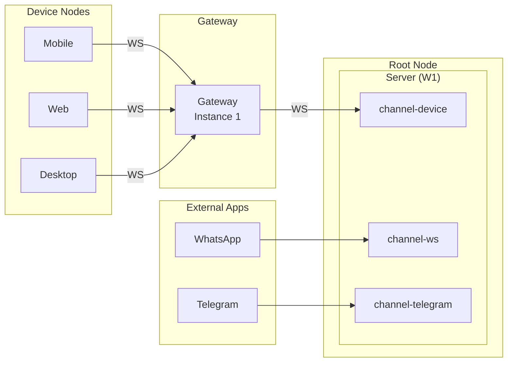
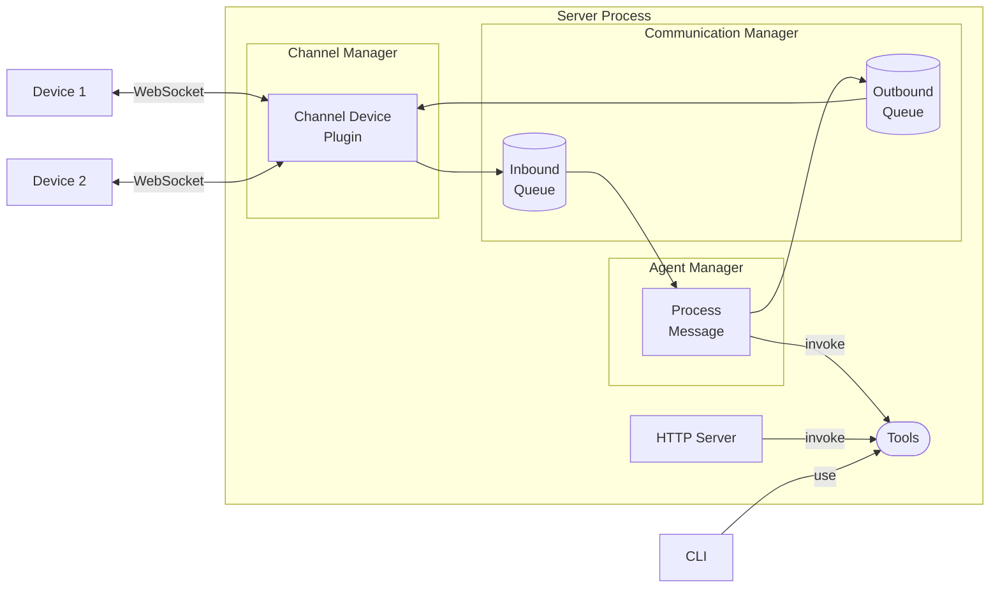

Hiro League is a personal AI infrastructure that runs on your own hardware. Your desktop runs the agents, owns all your data, and manages all connected devices and services.

---

## Core concepts

### Root Node

The Root Node is your desktop machine — the central computer running Hiro League. It is the owner of all data, the authority for authentication, and the host for one or more workspaces.

Every workspace runs as a separate server process on the Root Node. Device nodes connect to it through a Gateway; the Root Node never connects outward to them.

### Server (PHBCLI)

`phbcli` is the command-line interface used to create, configure, and run workspaces. The same operations available through the CLI are also exposed as HTTP endpoints and as tools the AI agent can invoke — all sharing a single unified tool interface.

When you start a workspace, `phbcli` launches a server process that runs all workspace components concurrently.

### Device nodes

A device node is any client that connects to Hiro League — a mobile app, a web browser, another desktop. Device nodes communicate with the server through a Gateway, and can send messages, receive agent responses, or report device state.

### Gateway

The Gateway is the authentication and routing boundary between device nodes and a workspace. It validates device identity, handles pairing, and routes traffic through to the server. Unrecognized or unpaired devices are denied before they can reach the workspace.

A Gateway instance can run directly on the Root Node for local access, or on a cloud VPS for remote access over the internet. In both cases, the Root Node initiates the connection outward — no inbound ports need to be opened on your home network. One Gateway instance connects to exactly one workspace.

### Workspace

A workspace is an isolated runtime environment: its own configuration, keys, ports, and data. You can run multiple workspaces on the same Root Node — for example, `production`, `dev`, and `test` — each fully independent of the others.

A workspace is a data container and configuration unit. The server process loads a workspace at startup; the workspace does not define or control the server.

---

## How devices connect

Device nodes connect to the Root Node through a Gateway instance via WebSocket. External apps (such as Telegram and WhatsApp) connect directly to their respective channel plugins inside the server — they do not go through the Gateway.

<Frame caption="View full size">
  
</Frame>

---

## Server components

The server process runs all of the following components as concurrent asyncio coroutines inside a single Python process. Each has a distinct responsibility.

### Channel Manager

The Channel Manager spawns and supervises channel plugins — subprocesses that handle inbound and outbound messages for each connected interface. The core plugin is `channel-device`, which manages WebSocket connections from device nodes.

Each channel plugin runs as a separate subprocess and communicates back to the server over a local WebSocket using JSON-RPC 2.0.

### Communication Manager

The Communication Manager is the central message router inside the server. It maintains an inbound queue (messages arriving from channels) and an outbound queue (replies going back to channels). It also runs permission checks before messages reach the agent.

### Agent Manager

The Agent Manager consumes messages from the Communication Manager's inbound queue, runs them through a LangChain agent, and pushes replies to the outbound queue. The agent can invoke Tools as part of processing a message.

### HTTP Server

The HTTP Server exposes the workspace's REST API — for status checks, channel listing, tool listing, and direct tool invocation. It uses the same Tool interface as the CLI and the Agent Manager.

### Tools

Tools is the shared execution layer used by the CLI, the HTTP Server, and the Agent Manager. Any operation you can run from the command line can also be triggered via HTTP or requested from the agent.

<Frame caption="View full size">
  
</Frame>

---

## What's next

<CardGroup cols={2}>
  <Card title="Channel Manager" icon="plug" href="/architecture/channel-manager">
    Plugin spawning, subprocess lifecycle, and JSON-RPC communication.
  </Card>
  <Card title="Communication Manager" icon="arrows-left-right" href="/architecture/communication-manager">
    Message routing, inbound/outbound queues, and permission checks.
  </Card>
  <Card title="Agent Manager" icon="robot" href="/architecture/agent-manager">
    LLM worker, conversation memory, and available tools.
  </Card>
  <Card title="Gateway instances" icon="shield" href="/phb/gateway-instances">
    Local vs VPS gateway configuration and device authentication.
  </Card>
  <Card title="Tools architecture" icon="wrench" href="/architecture/tools-architecture">
    How CLI commands, HTTP endpoints, and agent tools share the same interface.
  </Card>
</CardGroup>
