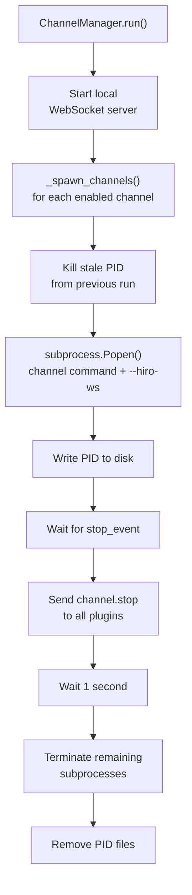

The Channel Manager runs a local WebSocket server and manages the lifecycle of all channel plugins. It spawns each enabled channel as a separate subprocess on startup, accepts their JSON-RPC connections, and routes messages between plugins and the rest of the server.

It runs as an asyncio coroutine alongside the Communication Manager, Agent Manager, and HTTP Server inside the server process.

---

## Responsibilities

**Plugin spawning** — On startup, the Channel Manager reads all enabled `ChannelConfig` entries from `<workspace>/channels/` and spawns one subprocess per channel. Each subprocess receives the local WebSocket address via `--hiro-ws` and a log directory via `--log-dir`.

**Connection handling** — Plugins connect back over WebSocket using JSON-RPC 2.0. The Channel Manager accepts these connections and dispatches each incoming message by its `method` field.

**Inbound routing** — `channel.receive` notifications from plugins are forwarded to the `on_message` callback, which is the Communication Manager's `receive()` method.

**Event routing** — `channel.event` notifications (such as `gateway_connected` or `pairing_request`) are forwarded to the `on_event` callback, which is handled directly in the server process for pairing logic.

**Outbound dispatch** — The Communication Manager calls `send_to_channel()` or `broadcast()` to push messages back to one or all connected plugins.

**Graceful shutdown** — On stop, the Channel Manager sends a `channel.stop` notification to each connected plugin, waits one second, then terminates any subprocesses that are still running.

---

## Plugin lifecycle



<Frame caption="View full size">
  
</Frame>

---

## Connection protocol

Channel plugins communicate with the Channel Manager over a local WebSocket at `ws://127.0.0.1:<plugin_port>` using JSON-RPC 2.0.

**Notifications** (no `id`) are used for fire-and-forget messages in both directions. **Requests** (with `id`) are used when the sender needs a response — currently only `channel.status`.

### Plugin → Channel Manager

| Method | Direction | Description |
|---|---|---|
| `channel.register` | Notification | Plugin announces itself with `name`, `version`, and `description`. Triggers config push. |
| `channel.receive` | Notification | Plugin delivers an inbound `UnifiedMessage` to the server. |
| `channel.event` | Notification | Plugin reports an event such as `gateway_connected` or `pairing_request`. |

### Channel Manager → plugin

| Method | Direction | Description |
|---|---|---|
| `channel.send` | Notification | Deliver an outbound `UnifiedMessage` to the plugin. |
| `channel.configure` | Notification | Push updated configuration to the plugin. |
| `channel.stop` | Notification | Signal the plugin to shut down. |
| `channel.event` | Notification | Forward a server-side event to the plugin. |
| `channel.status` | Request | Ask the plugin for its current status. Awaited with a 5-second timeout. |

### Registration and config push

When a plugin sends `channel.register`, the Channel Manager stores the connection and immediately sends a `channel.configure` notification with the plugin's stored configuration. If a plugin with the same name was already connected, the old connection receives `channel.stop` and is closed with WebSocket close code `4010` before the new one is accepted.

---

## Subprocess isolation

Each channel plugin runs as a fully isolated subprocess:

- **Windows**: `CREATE_NEW_PROCESS_GROUP | CREATE_NO_WINDOW` flags
- **Unix/macOS**: `start_new_session=True`
- `stdout` and `stderr` are discarded — plugins write to their own log files in `--log-dir`

The Channel Manager writes each child's PID to `<workspace>/channels/<name>.pid` immediately after spawning. On the next startup, any stale PID file from a previous run is used to kill the old process before a new one is spawned.

---

## Channel configuration

Each channel's configuration is stored as `<workspace>/channels/<name>.json` and loaded into a `ChannelConfig` dataclass.

| Field | Description |
|---|---|
| `name` | Channel identifier, e.g. `device`, `telegram` |
| `enabled` | Whether the channel is spawned on startup |
| `command` | Subprocess command. Defaults to `["hiro-channel-<name>"]` |
| `config` | Arbitrary key-value pairs pushed to the plugin on registration |
| `workspace_dir` | Optional path for `uv run` dev mode |

---

## Integration

The Channel Manager is wired to the rest of the server in `server_process.py`:

```python
comm_manager = CommunicationManager()
channel_manager = ChannelManager(
    config, workspace_path, stop_event,
    on_message=comm_manager.receive,   # channel.receive → inbound queue
    on_event=_on_channel_event,        # channel.event → pairing logic
)
comm_manager.set_channel_manager(channel_manager)  # outbound queue → send_to_channel
```

The HTTP Server also calls `get_channel_info()` to expose connected channel metadata on the status endpoint.

---

## See also

<CardGroup cols={2}>
  <Card title="Architecture overview" icon="sitemap" href="/architecture/architecture-overview">
    How the Channel Manager fits into the server process.
  </Card>
  <Card title="Communication Manager" icon="arrows-left-right" href="/architecture/communication-manager">
    The message router that sits between the Channel Manager and the Agent Manager.
  </Card>
</CardGroup>
