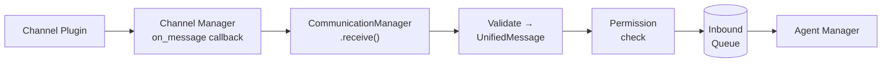
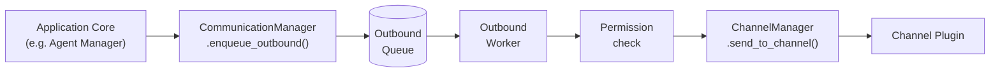

The Communication Manager sits between the Channel Manager and the rest of the server. Every message arriving from a channel plugin passes through it before reaching any consumer, and every reply from the application core must go through it before being dispatched back to a channel.

It runs as an asyncio coroutine alongside the Channel Manager and HTTP Server inside the server process.

---

## Responsibilities

**Inbound routing** — The Communication Manager is registered as the Channel Manager's `on_message` callback. When a channel plugin delivers a message, the Communication Manager validates it, runs a permission check, and places it on the inbound queue for downstream consumers (currently the Agent Manager).

**Outbound routing** — An internal worker continuously drains the outbound queue. For each message it runs a permission check, then calls `ChannelManager.send_to_channel` to dispatch it to the correct channel plugin.

**Permission enforcement** — Both inbound and outbound messages pass through `_check_permissions`. This is currently a placeholder — raising a `PermissionError` silently drops the message with a warning log. Once the permission system is designed it will enforce channel-level ACLs, sender/recipient authorization, and rate limits.

**Message validation** — Raw `dict` payloads from channel plugins are validated into `UnifiedMessage` before entering the queue. Malformed messages are dropped with a warning and never reach the agent.

---

## Message flow

### Inbound

A message travels from a channel plugin to the Agent Manager through the Communication Manager:



<Frame caption="View full size">
  
</Frame>

### Outbound

A reply travels from the application core back to a channel plugin:



<Frame caption="View full size">
  
</Frame>

---

## UnifiedMessage

All messages in the system use `UnifiedMessage` — the canonical cross-channel format defined in `phb-channel-sdk`. Every channel plugin translates its native format to and from this model.

`direction` is always from the perspective of the server:

- `"inbound"` — a message arriving from a user or external service
- `"outbound"` — a reply to be sent to a user or external service

| Field | Type | Description |
|---|---|---|
| `id` | `str` | Auto-generated UUID hex |
| `channel` | `str` | Channel name (e.g. `"telegram"`, `"device"`) |
| `direction` | `str` | `"inbound"` or `"outbound"` |
| `sender_id` | `str` | Originating user or service identifier |
| `recipient_id` | `str \| None` | Target user or service identifier |
| `content_type` | `str` | Defaults to `"text"` |
| `body` | `str` | Message content |
| `metadata` | `dict` | Channel-specific extra data |
| `timestamp` | `datetime` | UTC timestamp, auto-set on creation |

---

## Queues

Both queues are public `asyncio.Queue[UnifiedMessage]` instances. Downstream consumers read directly from `inbound_queue`; callers should always write to `outbound_queue` via `enqueue_outbound()` rather than putting to the queue directly.

**`inbound_queue`** — Validated, permission-checked messages waiting to be consumed. The Agent Manager reads from this queue.

**`outbound_queue`** — Messages waiting to be dispatched to a channel plugin. Written to via `enqueue_outbound()`; drained by the internal outbound worker.

---

## Lifecycle

`CommunicationManager` is constructed before `ChannelManager`. After both exist, `set_channel_manager()` binds them together. The `run()` coroutine is then added to `asyncio.gather` so the outbound worker starts alongside the rest of the server.

```python
comm = CommunicationManager()
channel_manager = ChannelManager(..., on_message=comm.receive)
comm.set_channel_manager(channel_manager)

await asyncio.gather(
    channel_manager.run(),
    comm.run(),
    http_server.run(),
)
```

---

## See also

<CardGroup cols={2}>
  <Card title="Architecture overview" icon="sitemap" href="/architecture/architecture-overview">
    How the Communication Manager fits into the server process.
  </Card>
  <Card title="Agent Manager" icon="robot" href="/agent-manager">
    The primary consumer of the inbound queue.
  </Card>
</CardGroup>
