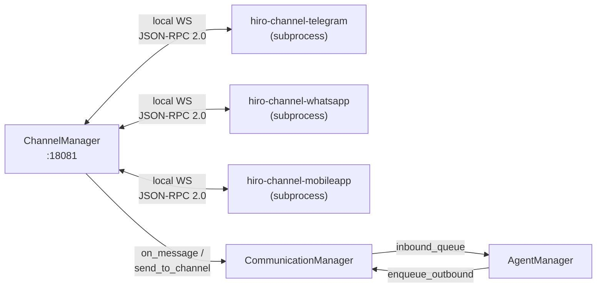
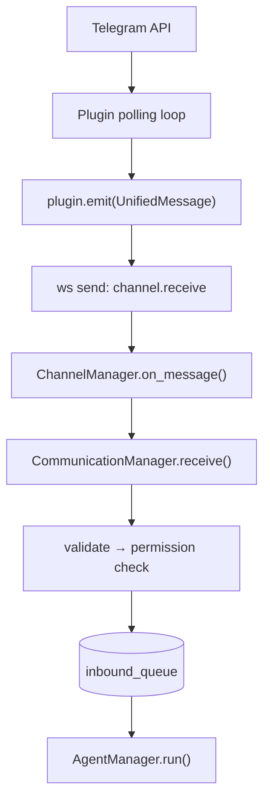
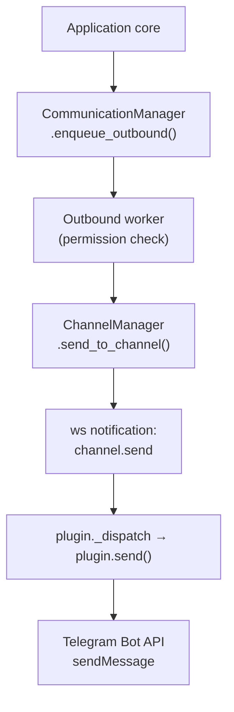
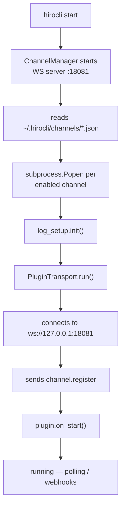

Channel plugins are the mechanism by which Hiro League connects to third-party messaging platforms — Telegram, WhatsApp, a custom mobile app, and anything else that can send and receive messages.

Each plugin is a **standalone Python package** that runs as a **subprocess** managed by `hirocli`. It connects back to hirocli over a **local WebSocket** and speaks a **JSON-RPC 2.0** protocol. The plugin is entirely responsible for translating between the unified Hiro League message format and whatever the third party requires.

---

## Design goals

| Goal | How it is achieved |
|---|---|
| Dependency isolation | Each plugin is its own uv workspace member with its own virtualenv — no conflicts between e.g. `python-telegram-bot` and a WhatsApp SDK |
| Crash isolation | A plugin crash does not bring down hirocli or other plugins |
| Independent updates | Plugins are versioned and updated separately from the core server |
| Uniform interface | All plugins speak the same JSON-RPC 2.0 dialect over a local WebSocket |
| Developer ergonomics | `hiro-channel-sdk` provides the full contract; authoring a new plugin requires implementing 4 methods |

---

## System overview



<Frame caption="View full size">
  
</Frame>

---

## Components

### hiro-channel-sdk

The shared library that defines the contract between hirocli and every plugin. It is a uv workspace member (`hiroserver/hiro-channel-sdk/`) and a declared dependency of every channel package.

| Module | Exports | Purpose |
|---|---|---|
| `models.py` | `UnifiedMessage`, `ChannelInfo`, `RpcRequest`, `RpcResponse` | Pydantic data models |
| `base.py` | `ChannelPlugin` | Abstract base class plugins implement |
| `rpc.py` | `build_*`, `parse_message` | JSON-RPC 2.0 wire-format helpers |
| `transport.py` | `PluginTransport` | WS client that connects to hirocli and dispatches calls |

### ChannelManager

Lives in `hirocli/channel_manager.py`. On `hirocli start` it:

1. Opens a WebSocket server on `ws://127.0.0.1:<plugin_port>` (default `18081`).
2. Reads `~/.hirocli/channels/*.json` to discover enabled channels.
3. Spawns one subprocess per enabled channel, appending `--hiro-ws <url>` and `--log-dir <path>`. Subprocess stdout/stderr are discarded — each plugin writes its own rotating log file to the log directory.
4. Accepts incoming connections from plugin processes.
5. Pushes the stored per-channel config (`config` field) to each plugin immediately after it registers.
6. Routes inbound messages from plugins to the configured `on_message` callback.
7. On shutdown: sends `channel.stop` to every plugin, waits 1 second, then terminates any remaining subprocesses.

### CommunicationManager

The central message router between `ChannelManager` and the application core — handles inbound/outbound queuing and permission checks.

See [Communication Manager](/architecture/communication-manager) for full details.

### AgentManager

The LLM worker that consumes text messages from the inbound queue, invokes a LangChain v1 `create_agent` instance, and pushes replies to the outbound queue. Per-conversation memory is maintained using LangGraph's `InMemorySaver` checkpointer, keyed by `channel:sender_id`.

See [Agent Manager](/architecture/agent-manager) for full details.

---

## Channel config files

Channel configuration is stored at `~/.hirocli/channels/<name>.json` and managed via `hirocli channel setup|enable|disable|remove`.

```json
{
  "name": "telegram",
  "enabled": true,
  "command": ["hiro-channel-telegram"],
  "config": {
    "bot_token": "123456:ABC-..."
  }
}
```

---

## JSON-RPC 2.0 protocol

All messages are UTF-8 JSON over a single WebSocket connection per plugin. A **notification** has no `"id"` field (fire-and-forget). A **request** has an `"id"` and expects a **response** with the same `"id"`.

### Plugin → hirocli

| Method | Type | Params | When |
|---|---|---|---|
| `channel.register` | notification | `{name, version, description}` | First frame after connect — mandatory |
| `channel.receive` | notification | `UnifiedMessage` (dict) | Inbound message from third party |
| `channel.event` | notification | `{event: str, data: any}` | Status changes, delivery receipts, errors |

### hirocli → plugin

| Method | Type | Params | Purpose |
|---|---|---|---|
| `channel.send` | notification | `UnifiedMessage` (dict) | Send a message out through this channel |
| `channel.configure` | notification | `{config: {…}}` | Push credentials and settings |
| `channel.status` | request | — | Health probe — expects `{name, version, status}` |
| `channel.stop` | notification | — | Graceful shutdown signal |

### Inbound message flow



<Frame caption="View full size">
  
</Frame>

### Outbound message flow



<Frame caption="View full size">
  
</Frame>

---

## UnifiedMessage format

All messages in the system use `UnifiedMessage` — the canonical cross-channel format defined in `hiro-channel-sdk`.

`direction` is always from hirocli's perspective:
- `"inbound"` — arriving from the third party (user sent something)
- `"outbound"` — to be sent to the third party

```json
{
  "id": "a3f9c2d1...",
  "channel": "telegram",
  "direction": "inbound",
  "sender_id": "123456789",
  "recipient_id": null,
  "content_type": "text",
  "body": "Hello!",
  "metadata": {
    "chat_id": 123456789,
    "message_id": 42
  },
  "timestamp": "2026-02-27T10:00:00+00:00"
}
```

| Field | Type | Notes |
|---|---|---|
| `id` | `str` | Auto-generated UUID hex |
| `channel` | `str` | Plugin name, e.g. `"telegram"` |
| `direction` | `str` | `"inbound"` or `"outbound"` |
| `sender_id` | `str` | Channel-native user identifier |
| `recipient_id` | `str \| None` | Channel-native target identifier |
| `content_type` | `str` | `"text"` \| `"image"` \| `"audio"` \| `"video"` \| `"location"` \| `"command"` \| `"file"` |
| `body` | `str` | Text content or caption |
| `metadata` | `dict` | Channel-specific extras — free-form |
| `timestamp` | `datetime` | UTC, auto-generated |

---

## Plugin lifecycle



<Frame caption="View full size">
  
</Frame>

On `hirocli stop`: the stop event is set, `channel.stop` is sent to each plugin, hirocli waits 1 second, then terminates any remaining subprocesses.

---

## uv workspace layout

```
hiroserver/
├── pyproject.toml              # workspace root: members = [..., "hiro-channel-sdk", "channels/*"]
├── hiro-channel-sdk/            # shared SDK (workspace member)
└── channels/
    ├── hiro-channel-echo/       # echo test plugin (workspace member)
    ├── hiro-channel-telegram/   # (future)
    └── hiro-channel-whatsapp/   # (future)
```

Each channel package declares `hiro-channel-sdk` as a workspace dependency, giving it an isolated virtualenv while sharing the workspace's common resolved lockfile.

---

## See also

<CardGroup cols={2}>
  <Card title="Creating channel plugins" icon="code" href="/architecture/plugins/creating-channel-plugins">
    Step-by-step guide to writing, installing, and configuring a new plugin.
  </Card>
  <Card title="Communication Manager" icon="arrows-left-right" href="/architecture/communication-manager">
    The message router that sits between the Channel Manager and the application core.
  </Card>
</CardGroup>
