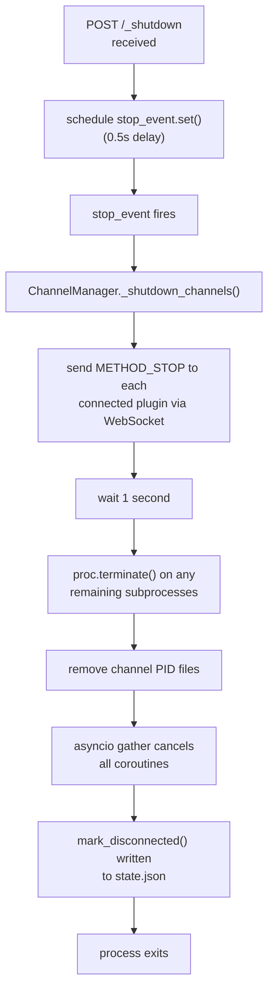
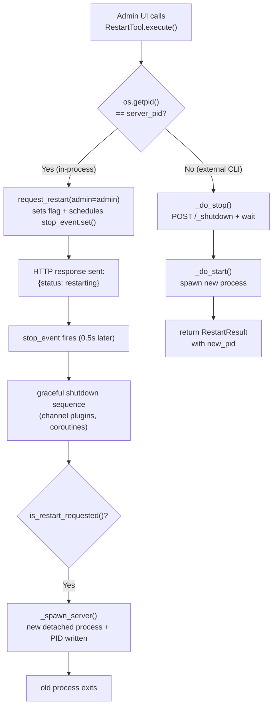

The server process is an asyncio event loop that runs several concurrent coroutines: the HTTP server, the channel manager, the communication manager, and the agent manager. Stopping or restarting it cleanly requires coordinating all of these — including the channel plugin subprocesses that the channel manager spawns.

## The problem with force kill

The naive approach to stopping the server is to send `SIGTERM` (Linux/macOS) or `taskkill /F` (Windows). On Linux/macOS, `SIGTERM` is caught by the signal handler and triggers a graceful shutdown. On Windows, `taskkill /F` is an immediate force kill — it bypasses the signal handler entirely.

The consequence of a force kill on Windows is that `ChannelManager._shutdown_channels()` never runs. That method sends a `METHOD_STOP` WebSocket notification to each connected channel plugin, waits one second for them to disconnect, then calls `proc.terminate()` on any remaining subprocesses and removes their PID files. Without it, channel plugin subprocesses are orphaned and continue running after the server exits.

## HTTP-based graceful shutdown

To solve this on all platforms, `hirocli stop` (and `hirocli restart`) no longer rely on OS signals as the primary shutdown path. Instead, the server exposes two internal HTTP endpoints:

| Endpoint | Method | Effect |
|---|---|---|
| `/_shutdown` | `POST` | Schedules `stop_event.set()` with a 0.5-second delay, then returns `{"status": "shutting_down"}` |
| `/_restart` | `POST` | Body: `{"admin": bool}`. Sets a restart flag, then calls the same shutdown path. Returns `{"status": "restarting"}` |

The 0.5-second delay gives the HTTP response time to flush before the event loop starts tearing down. Once `stop_event` is set, the normal shutdown sequence runs on every platform:

<Frame caption="View full size">
  
</Frame>

`hirocli stop` calls `POST /_shutdown`, then polls `is_running(pid)` for up to 10 seconds. If the process exits within that window, the stop is considered successful. If it does not (e.g. the server was not yet fully started and the HTTP port was unreachable), it falls back to `kill_process()` — force kill as a last resort, not the default.

---

## Restart paths

There are two distinct callers that can trigger a restart, and they require different mechanisms.

### Path 1 — External caller (CLI)

`hirocli restart` runs as a separate process, outside the server. It calls `_do_stop()` to send `POST /_shutdown` and wait for exit, then calls `_do_start()` to spawn a new detached background process. This is the simplest path: sequential stop → start, with full control over the new process flags (`admin`, `foreground`).

### Path 2 — In-process caller (admin UI)

The admin UI runs as a coroutine inside the server process itself (it is one of the tasks in `asyncio.gather`). When the admin UI calls `RestartTool().execute()` via `POST /invoke`, the tool detects that `os.getpid() == server_pid` — it is running inside the process it wants to restart. Calling `_do_stop` from here would kill its own process mid-execution before `_do_start` could run.

Instead, the tool calls `request_restart(admin=admin)` directly — a synchronous function in `http_server.py` that:

1. Sets `_restart_requested = True` and `_restart_admin = <value>` in module state
2. Schedules `stop_event.set()` via `call_later(0.5, ...)` on the running event loop
3. Returns immediately, allowing the HTTP response to be sent

The current `_main` coroutine then shuts down normally. After the shutdown sequence completes — after all coroutines cancel and `mark_disconnected()` writes state — `_main` checks `is_restart_requested()`. If true, it calls `_spawn_server()`, which launches a new detached server process and writes its PID, then the old process exits.

<Frame caption="View full size">
  
</Frame>

The in-process path returns `new_pid=None` in `RestartResult` because the new process PID is not available until after the current process exits. The admin UI can poll `GET /status` on the HTTP port to detect when the new server is up.

---

## Sequence summary

| Caller | Stop mechanism | Start mechanism | `new_pid` in result |
|---|---|---|---|
| `hirocli stop` | `POST /_shutdown` → wait → force kill fallback | — | — |
| `hirocli restart` | `POST /_shutdown` → wait → force kill fallback | `_do_start()` spawns new process | Available immediately |
| Admin UI (`/invoke restart`) | `request_restart()` sets flag + schedules `stop_event` | `_spawn_server()` runs after shutdown | `None` (process not yet started) |

---

## Module responsibilities

| Module | Responsibility |
|---|---|
| `runtime/http_server.py` | Owns `_stop_event`, `_restart_requested`, `_restart_admin`. Exposes `/_shutdown` and `/_restart` endpoints. Exposes `request_shutdown()` and `request_restart()` for direct in-process use. |
| `runtime/server_process.py` | Sets `stop_event` on `http_server` at startup. Checks `is_restart_requested()` after shutdown and calls `_spawn_server()` if set. Owns `_spawn_server()` which mirrors the background spawn logic from `tools/server.py`. |
| `tools/server.py` | `_do_stop()` calls `POST /_shutdown` and waits. `RestartTool` detects in-process vs external caller and dispatches accordingly. |
| `hiro_commons/process.py` | `stop_process()` / `kill_process()` — force kill fallback, used only when HTTP is unreachable. See [process spawning](/architecture/process-spawning) for background process management conventions. |
