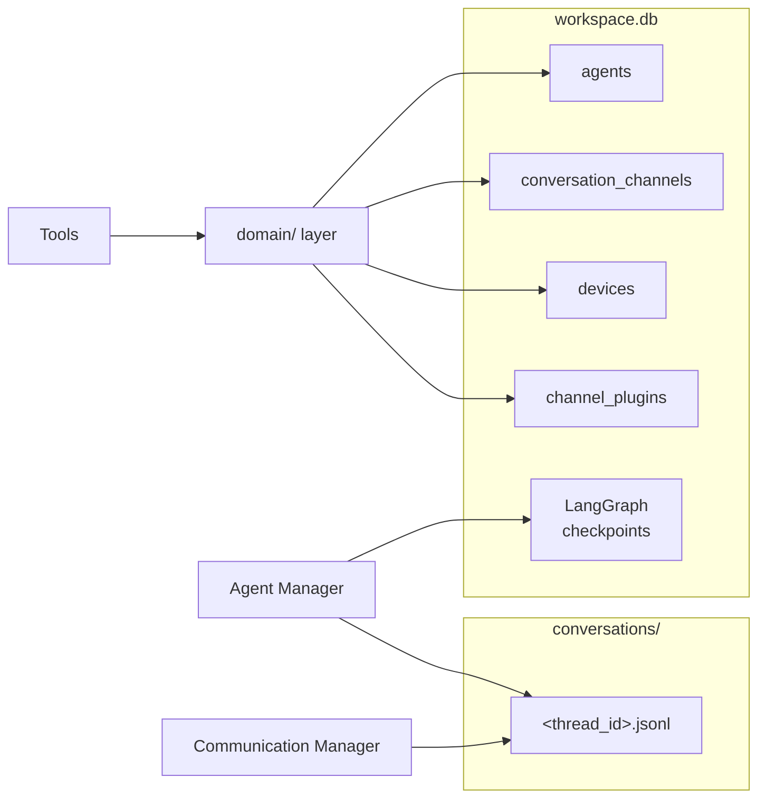
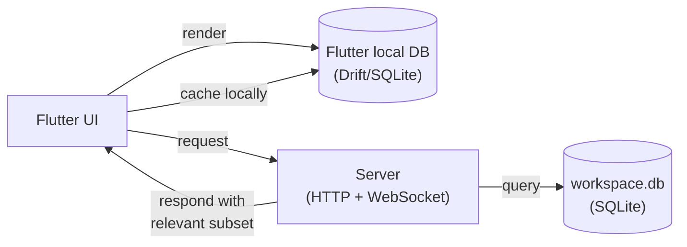

Each workspace maintains its own isolated data store. Data is split into two categories based on its access pattern: a SQLite database for structured entities that need querying and transactions, and append-only JSONL files for conversation message logs that need sequential writes and eventual full-text or semantic search.

---

## Storage layout

```
<workspace>/
├── config.json              ← single-record boot config (stays as file)
├── master_key.pem           ← ECDSA private key (stays as file)
├── workspace.db             ← SQLite: all structured entity data
├── conversations/
│   ├── <thread_id>.jsonl    ← append-only message log, one file per thread
│   └── ...
└── logs/
```

`config.json` and `master_key.pem` are intentionally kept as files. `config.json` is read at boot before the database can open, and `master_key.pem` is a crypto artifact — neither benefits from a relational store.

The global workspace registry (`registry.json`, one level above all workspaces) also stays as a file for the same reason: it is read before any workspace is selected.

---

## SQLite — `workspace.db`

`workspace.db` holds all structured entities: things with a defined schema, a bounded row count, and access patterns based on identity (get by id) or membership (list all, filter by field).

### Tables

#### `agents`

Replaces `<workspace>/agent/config.json`. Supports multiple named agent definitions per workspace.

| Column | Type | Notes |
|---|---|---|
| `id` | TEXT PK | UUID |
| `name` | TEXT | Human-readable label, unique within workspace |
| `is_default` | BOOLEAN | Only one agent may be default at a time |
| `provider` | TEXT | LangChain provider identifier (e.g. `openai`) |
| `model` | TEXT | Model name (e.g. `gpt-4.1-mini`) |
| `temperature` | REAL | Sampling temperature |
| `max_tokens` | INTEGER | Max reply tokens |
| `system_prompt` | TEXT | Full system prompt text (was `agent/system_prompt.md`) |
| `created_at` | TEXT | ISO 8601 |

#### `conversation_channels`

Holds the metadata for each conversation thread — the "shape" of a conversation, not its messages.

| Column | Type | Notes |
|---|---|---|
| `id` | TEXT PK | UUID — also used as the JSONL filename and LangGraph thread_id |
| `name` | TEXT | Display name (e.g. "Home", "Personal") |
| `type` | TEXT | `direct` or `group` |
| `agent_id` | TEXT FK → agents | Which agent handles this channel |
| `created_at` | TEXT | ISO 8601 |
| `last_message_at` | TEXT | ISO 8601, updated on each new message, used for sort order |

#### `devices`

Replaces `<workspace>/devices.json`.

| Column | Type | Notes |
|---|---|---|
| `device_id` | TEXT PK | |
| `device_public_key` | TEXT | Base64 encoded |
| `paired_at` | TEXT | ISO 8601 |
| `expires_at` | TEXT | ISO 8601, nullable |
| `metadata` | TEXT | JSON blob for arbitrary device metadata |

#### `channel_plugins`

Replaces the per-file `<workspace>/channels/<name>.json` pattern. One row per installed channel plugin.

| Column | Type | Notes |
|---|---|---|
| `name` | TEXT PK | Plugin identifier (e.g. `telegram`, `devices`) |
| `enabled` | BOOLEAN | |
| `command` | TEXT | JSON array — subprocess command |
| `config` | TEXT | JSON blob — plugin-specific settings |

---

## Conversation messages — `conversations/<thread_id>.jsonl`

Message logs are **not** stored in SQLite. Messages are append-only, unbounded in volume, and their primary access patterns (full-text search, semantic retrieval, RAG) do not benefit from a relational model.

Each conversation thread has a single JSONL file. `thread_id` is the same UUID used as the `conversation_channels.id` primary key, so the filename is always `<workspace>/conversations/<channel_id>.jsonl`.

Each line is a self-contained JSON record:

```json
{ "id": "<uuid>", "sender_id": "device:abc123", "role": "user", "content_type": "text", "body": "Hello", "ts": "2026-03-09T10:00:00Z" }
{ "id": "<uuid>", "sender_id": "agent:default", "role": "assistant", "content_type": "text", "body": "Hi, how can I help?", "ts": "2026-03-09T10:00:01Z" }
```

| Field | Description |
|---|---|
| `id` | UUID per message |
| `sender_id` | Prefixed identifier: `device:<id>`, `agent:<name>`, `channel:<name>` |
| `role` | `user` or `assistant` |
| `content_type` | `text`, `image`, `voice`, `tool_result` |
| `body` | Serialized content payload |
| `ts` | ISO 8601 timestamp |

This format is intentionally simple. The files can be tailed, grepped, and fed into a vector store or search index without transformation when that becomes relevant.

---

## Conversation memory (LangGraph)

The Agent Manager currently uses `InMemorySaver` as its LangGraph checkpointer. This is replaced with `SqliteSaver` pointing at `workspace.db`, using the same `thread_id` (`channel_id` UUID) as the checkpoint key.

This gives the agent persistent memory across server restarts without any change to the Agent Manager's message-processing logic.

```python
from langgraph.checkpoint.sqlite.aio import AsyncSqliteSaver

async with AsyncSqliteSaver.from_conn_string(str(workspace_db_path)) as checkpointer:
    agent = create_agent(llm, tools, checkpointer)
```

LangGraph manages its own internal checkpoint tables inside `workspace.db` — they coexist with the application tables without conflict.

---

## How components interact with the store



<Frame caption="View full size">
  
</Frame>

The `domain/` layer is the only code that reads from or writes to the SQLite application tables. Tools, HTTP handlers, and CLI commands all go through domain functions — they are not aware of the database directly. The Agent Manager and Communication Manager write message logs directly to JSONL files.

---

## Schema evolution policy

These rules keep schema changes cheap and existing user databases safe without a migration runner.

### Additive-only columns

Never drop or rename a column once it exists in a deployed database. Add new columns; abandon old ones in place. An unused column costs nothing and keeps old databases readable without any upgrade step — exactly like Pydantic ignoring extra JSON keys.

When a column must logically go away, stop reading it in Python and leave the SQL column untouched. Drop it only as a deliberate clean-up step on a known minimum SQLite version.

### Introspection-based upgrade in `ensure_db`

`ensure_db` and `init_db` run two passes on every startup:

1. **`CREATE TABLE IF NOT EXISTS`** — creates all tables on a fresh database.
2. **`PRAGMA table_info(<table>)` + `ALTER TABLE ADD COLUMN`** — adds any columns that are present in `_EXPECTED_COLUMNS` but absent from the actual table.

`_EXPECTED_COLUMNS` is the authoritative list of every non-primary-key column in the schema. Adding a column means appending one entry to that list; the upgrade runs automatically on next startup for every existing database. No version counter, no migration state to track.

```python
# To add a column, append to _EXPECTED_COLUMNS — never remove existing entries.
_EXPECTED_COLUMNS: list[tuple[str, str, str]] = [
    ("agents", "new_field", "TEXT NOT NULL DEFAULT ''"),
    ...
]
```

### JSON columns for flexible sub-fields

Columns whose internal structure is likely to change (`config`, `metadata`, `command`) are stored as JSON `TEXT` blobs. Adding a sub-field costs nothing — it is a Python dict change only, with no `ALTER TABLE` required. The JSON columns are always read whole and parsed in Python; no SQLite JSON functions are used, so there is no minimum SQLite version constraint for this pattern.

### Nullable or defaulted columns everywhere else

Every new column must either be nullable or carry a `DEFAULT` value. This is a hard requirement for `ALTER TABLE ADD COLUMN` to succeed on existing rows. Enforce `NOT NULL` without a default only on primary keys and columns that are set at insert time by application code.

### Destructive changes (rename, type change, drop)

`_EXPECTED_COLUMNS` only handles additive changes.  Renames, type changes, and column drops require either a versioned one-off SQL entry (gated by `PRAGMA user_version`) or a full table rebuild.  A lightweight migration runner for these cases will be added once development stabilises and the schema reaches a stable baseline.  Until then, a `reset_db()` helper that deletes and recreates `workspace.db` is sufficient — users re-run `hirocli channel setup` and `hirocli device add` to repopulate.

### SQLite version floor

This project targets **Windows only with Python ≥ 3.11**. Python on Windows bundles its own SQLite (not the system library), so the version is deterministic:

| Python | Bundled SQLite | Key capabilities unlocked |
|---|---|---|
| 3.11 | 3.39.x | `DROP COLUMN` (3.35+), `RENAME COLUMN` (3.25+) |
| 3.12 | 3.43.x | JSON operators `->` / `->>` (3.38+) |

All features described in this section are available on the minimum supported version (Python 3.11 / SQLite 3.39).

---

## Flutter app relationship

The Flutter app maintains its own local Drift/SQLite database. This is **not a sync** — the two databases are structurally different and serve different purposes.



<Frame caption="View full size">
  
</Frame>

The server database is authoritative and holds data for all devices, all users, and all contexts. The Flutter app requests only what is relevant to the current device and user. The server queries its database and returns a shaped response. The Flutter app caches locally for rendering speed and offline access.

There is no mirroring, no reconciliation, and no two-way binding between the two databases.

---

## Implementation steps

### 1. Add dependencies

Add to `hiroserver/hirocli/pyproject.toml`:

```toml
aiosqlite = "*"
sqlmodel = "*"
```

`aiosqlite` provides async SQLite access. `SQLModel` combines Pydantic (already used in `domain/`) with SQLAlchemy table definitions, so existing domain models can evolve into table-backed models with minimal friction.

### 2. Create the database module

Create `hiroserver/hirocli/src/hirocli/domain/db.py`:

- `async def init_db(workspace_path: Path) -> aiosqlite.Connection` — opens `workspace.db`, runs `CREATE TABLE IF NOT EXISTS` for all four tables, returns the connection
- `async def get_db(workspace_path: Path)` — async context manager wrapping `init_db`

Pass the open connection down through domain functions; do not open a new connection per operation.

### 3. Migrate domain entities

Replace each JSON file's `load_*` / `save_*` helpers in `domain/` with async functions that read from and write to `workspace.db`:

| Current file | Replaces | Domain module |
|---|---|---|
| `agent/config.json` + `agent/system_prompt.md` | `agents` table | `domain/agent_config.py` |
| `devices.json` | `devices` table | `domain/pairing.py` |
| `channels/<name>.json` files | `channel_plugins` table | `domain/channel_config.py` |

Add `domain/conversation_channel.py` (new) for CRUD on `conversation_channels`.

No changes are needed above the `domain/` layer — tools, commands, and runtime services call the same function signatures.

### 4. Create the conversation log writer

Create `hiroserver/hirocli/src/hirocli/domain/conversation_log.py`:

- `async def append_message(workspace_path: Path, channel_id: str, message: dict)` — opens `conversations/<channel_id>.jsonl` in append mode, writes one JSON line
- `async def read_messages(workspace_path: Path, channel_id: str, limit: int = 100) -> list[dict]` — reads the last `limit` lines from the file

Ensure `conversations/` directory is created during workspace initialisation.

### 5. Swap LangGraph checkpointer

In `runtime/agent_manager.py`, replace `InMemorySaver` with `AsyncSqliteSaver`:

```python
from langgraph.checkpoint.sqlite.aio import AsyncSqliteSaver

# inside AgentManager.__init__ or run():
self._checkpointer = AsyncSqliteSaver.from_conn_string(str(workspace_db_path))
```

The `thread_id` passed to `agent.ainvoke()` should be the `conversation_channels.id` UUID, replacing the current `channel:sender_id` string. This ties checkpointed memory to a persistent conversation channel record.

### 6. Wire database initialisation into server startup

In `runtime/server_process.py`, call `init_db(workspace_path)` once during startup before any services start. Pass the open connection (or a factory) to `AgentManager`, `ChannelManager`, and any domain functions that need it.

### 7. Remove migrated JSON files

Once each domain module is reading from the database, delete the corresponding JSON file generation code and remove any references to the old file paths. No backward compatibility is required.

---

## See also

<CardGroup cols={2}>
  <Card title="Agent Manager" icon="robot" href="/architecture/agent-manager">
    How conversation memory and LangGraph checkpointing work.
  </Card>
  <Card title="Tools architecture" icon="wrench" href="/architecture/tools-architecture">
    How domain functions are exposed as tools to the CLI, HTTP, and agent.
  </Card>
  <Card title="Channel Manager" icon="plug" href="/architecture/channel-manager">
    Channel plugin lifecycle and how plugin configs are loaded.
  </Card>
</CardGroup>
